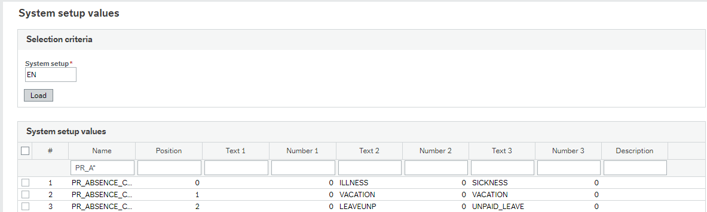
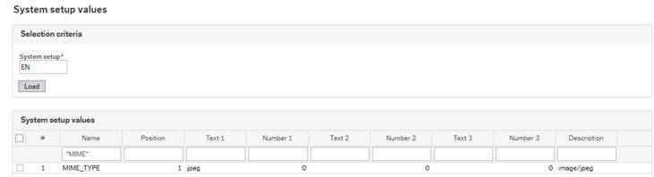

# Absence Assistant

Wanda lets users submit absence requests and report sickness, and include supporting documentation such as a medical certificate as an attachment. 

### System requirements

-	Unit4 Me Experience pack version 1.3 or later (latest version recommended)
-	Unit4Me V201501 web service installed and configured 

### System setup

-	Assign access rights for the relevant users to the **Unit4Me service V201501 service** (found under _Mobile Services_ in the menu-based acccess screen in Unit4 Business World desktop).
-   Attaching documents to an absence requires a document type which uses the **Resource absence document key**.
-	Absence groups must be mapped to their respective absence categories in the **(AG05)** or **(TAG005) System setup values** window.  This is similar to how balance categories are mapped, but with PR\_ABSENCE_CAT. Business World absence codes are related to a specific absence group within the application. By mapping the groups to their supported category (below), only the relevant codes are displayed when a category is chosen, for example:

	 

	When selecting the absence category **SICKNESS**, only the absence codes related to the absence group **ILLNESS** are returned. The same concept applies to absence groups mapped to **VACATION, UNPAID_LEAVE, etc.** Without this setup, all available absence codes are displayed with all categories. The supported absence categories include:

	- SICKNESS 
	- VACATION
	- PAID\_LEAVE
	- UNPAID\_LEAVE
	- TRAINING

	Currently, these are the only values allowed in _Text 3_ (see above). The absence groups (_Text 2_) are user-defined (setup in the **TPS044 Absence group** window). The relational attribute used to group absence codes in the **TPS044 Absence group** window must have **ID = NS**.

	> **Note:** The use of position-mandatory absence codes is not supported. Though Wanda will display such codes, an absence request using a position-mandatory code will not be submitted.
- A MIME_TYPE system setup value must be added to allow upload of absence-related files with the .jpeg extension (the .jpg extension is already supported without the need for a system setup value.)
	
	

		
