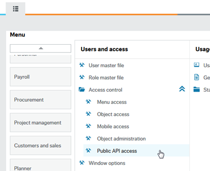
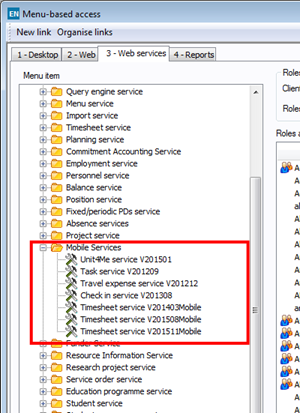

# Access setup overview

Wanda relies on users having access to a set of APIs and objects exposed on the customer's Unit4 Business World installation. This section gives an overview of the access setup required for Wanda.

To get a overview of the required access setup for Wanda, see the [access checklist](access-checklist.md). In addition all assistant specific implementation guides include a description of the required access configuration.

## Public Web APIs

Assistants in Wanda rely on access to public WEB APIs exposed on the customers Unit4 Business World installation. Granting access to public WEB APIs is done in the **(XAG005) Public API access** window in the Unit4 Business World web client.

The assistant specific implementation guides specify which endpoints users need access to.

## Web services (SOAP API)

Assistants in Wanda will in some cases rely on SOAP services. SOAP services are installed and configured using the Unit4 Management Console. Granting access to SOAP services is done in the Unit4 Business World Desktop client in the _**Web services**_ tab in the **(AG65) Role/user based access** or the **(AG68) Menu-based access** window.

The services used by Wanda are located in the _**Web services**_ tab in the **Mobile Services** node.

The assistant specific implementation guides specify which endpoints users need access to. 

The relevant SOAP services for Wanda are:

- Unit4Me Service V201501
- Timesheet service V201511Mobile
- Travel expenses service V201212
- Task service V201209

## Object Access

Setting up object access is done on the Unit4 Business World web client and consists of two steps for a user .

* The user must be granted access to the **Objects** Public API in the **(XAG005) Public API access** window.
* The user must be granted access to the specific objects required by Wanda. Objects access is configured in the the **(XAG002) Object access** window.

The assistant specific implementation guides specify which objects users need access to.

## Access to attributes and attribute values

Setting up access to attributes and attribute values follows the same process as for other **Objects**. The users must be granted access to the **Objects** Public API and have access to the **Attributes** and **Attributes values** objects.

> Wanda does not consume version V2 of the Unit4 Public API, therefore you cannot setup access specifically on the **Attributes** and **Attribute values** Public APIs. Customers running Milestone 7 or Milestone 8 will see specific nodes for setting access to **Attributes** and **Attribute values** in the **(XAG005) Public API access** window. Setting access on these items is not required for Wanda.

