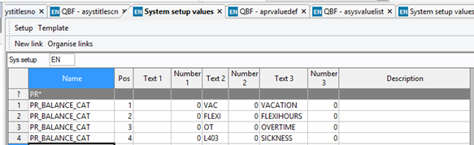

# Balances Assistant

Wanda lets users get relevant self-service information for the following balances:

* Vacation
* Sickness
* Flexi-time
* Overtime

### System requirements

-	Balances Public Web API exposed (_Your balances_)

### System setup

-	Assign access rights for the relevant users to the **Your balances** and **Employee balance setup** public APIs in the **(XAG005) Public API access** window on the Business World web client.
-	HR balances must be defined and assigned to each resource/user (if not already in place).
-	HR balances must be mapped to Wanda's balance categories in the **(AG05)** or **(TAG005) System setup values** window. 

	The balance categories defined in Wanda are as follows:
	* VACATION
	* FLEXIHOURS
	* OVERTIME
	* SICKNESS

    A setup example is shown below. The **_Name_** column contains PR\_BALANCE_CAT, **_Position_** contains values, **_Text2_** is the balance identifier (as defined in _**Balance references**_ in the **(TPR021) Value references** window), and **_Text3_** is the mapped balance category as defined in Wanda.

     

