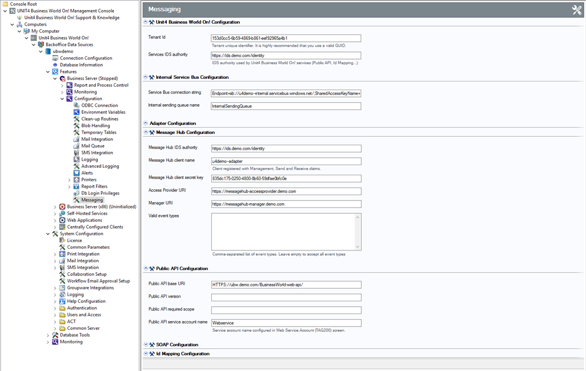

# Wanda notifications setup

The notifications / proactive conversations in Wanda requires that the customer's U4BW installation is configured with the Unit4 Business World Message Hub Adapter. 
The Message Hub Adapter provides the functionality to publish messages to a centrally configured Unit4 Message Hub in the Unit4 Cloud. The Message Hub instance will relay the relevant messages to Wanda.

> A detailed description of the required setup is found in the [Message Hub Adapter Reference Manual](http://unit4rd/ProductDocumentation/ABWDocsMain/RefMan_MessageHub_Spring2017.pdf). This guide will summarize the setup, and describe Wanda specific setup and topics.

## Connect Adapter to Unit4 Message Hub instance
The first step of is to assign the customer (tenant) a Unit4 Message Hub instance in the Unit4 Cloud. Then connect the U4BW instance the the Unit4 Message Hub instance.
This will rely on the Unit4 Cloud organization to be involved, since they have the access rights to adopt a customer into an existing Message Hub infrastructure.
Additional setup to configure the adapter is then conducted in the Management Console for the U4BW installation.
This is described in detail in the reference manual.

It involves the following steps:
- URL of Access Provider and Manager micro-services and the IDS used by that Message Hub. These URLs are available in the Message Hub portal, but at the moment is only for Unit4 admins.
- IDS Client name and secret that will be used to create a MH sender/receiver for the adapter, so, it will need to be registered as a MH client also in the Portal. 

## Setup service account
The next step is to configure the service account for the Unit4 Messag Hub adapter. Define the service account in the **TAG200 Web Service Accounts window**. 
Then associate this account with the adapter in the Message Hub configuration section in the management console.
The service account must have access to the following:

- Objects Public API
- All objects that will be published on the messaging infrastructure

The [Access setup guide](access.md) explains how to grant access to Public APIs and objects.

## Configure Messaging in Business World Management Console
For notifications, Wanda uses Unit4 Message Hub which is configured in the **Messaging** node.

 

