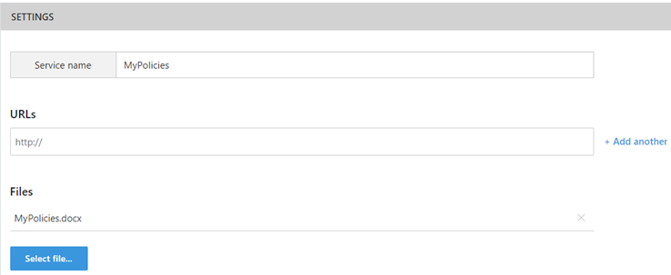
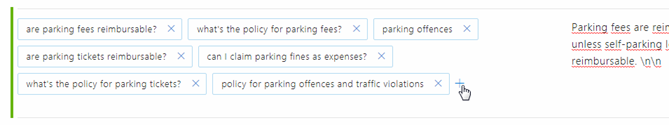
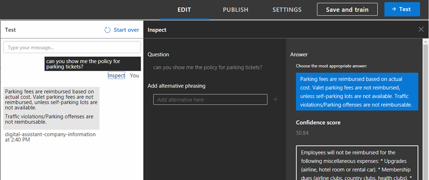
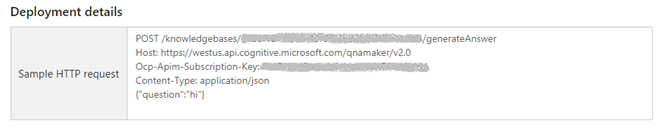

# Adding company specific policy information to Wanda (DRAFT)

The Wanda framework supports integration of simple company-specific policy information to allow it to be made available to users at any time from any device via the Wanda digital assistant. This allows users to quickly and easily get answers from Wanda on  simple company policy related questions related to, for example, company travel policies and HR policies etc.

## Policy solution overview

Tenant-specific policy functionality has been included within the global Wanda chatbot and the policy solution uses [Microsoft QnA Maker](http://www.qnamaker.ai) to create a custom policy question and answer knowledge base for inclusion within Wanda.

The QnA Maker service lets you very easily create your own company specific QnA/FAQ/Knowledge Base bot while requiring no coding. You simply load your QnA bot with predefined structured content – in this case policy questions and answers – and the QnA Maker service does the rest. The result is an endpoint which takes a query and returns a response containing the matching content. 

Each organisation is responsible for creating, adding and maintaining its policy information for inclusion in Wanda and involves the following high level steps:

* Prepare or create the policy document in a simple question and answer (FAQ) format
* Create a subscription on the Microsoft QnA Maker service website. Currently the QnA Maker service is free to use and has a usage restriction per subscription key of 10000 transactions per month and 10 per minute. Beyond this your requests will be throttled.
* Create a new service in QnA Maker and specify the URL of the policy webpage, or select the policy document for the service to use to create the policy knowledge base.
* Review the generated knowledge base questions and answer pairs and refine, test, train, refine and retrain the newly created policy knowledge base as required.
* Publish the knowledge base.
* Provide the deployment details to the Unit4 People Platform for inclusion in the Wanda service. (**to be defined**) .

Once your policy bot deployment details are configured in Wanda, users will then be able to ask policy related question in Wanda and Wanda will then give the corresponding answer from the generated policy knowledge base.  

## How policy information gets triggered in Wanda
Wanda has already been trained to understand policy related questions in this form:

* _What's the policy for budget hotels?_
* _What's the company policy for parking fines?_
* _Show me our policy for travel insurance._
* _Can you tell me our company policy for sundry expenses?_

If the user then asks Wanda a suitably formed policy related question, Wanda should give an appropriate answer with the relevant company-specific information.

The user can also choose to enter the help first by asking a help related question or saying 'help', and then ask a more specific policy questions such as _What class of car can I rent?_ and Wanda should be able to provide the company-specific answer here as well.

## Preparing the policy information
You can feed content to the QnA Maker service by importing an existing policy document, referencing one or more URLs and entering Q and A pairs directly into the Knowledge Base editorial section.

The QnA Maker service accepts question and answer pairs in any of these formats:

* Word (.docx)
* PDF (.pdf)
* Text (.txt)
* URL of webpage. You can choose to pass in one or more URLs to existing, publicly accessible, FAQ style pages as long as they have a consistent FAQ type HTML structure, then the QnA Maker service can extract the Qs and As.

How well the QnA Maker service is able generate a good knowledge base depends on how the original policy document is set up. For best results, the policy information should be structured as a set of clearly defined question and answer pairs and answers should ideally be as concise as possible. Therefore, an existing policy document might need some rework, depending on how it's originally setup, to get it into the optimum format prior to being processed by the QnA Maker service. However, this is not typically a big job and is easy to do. 

### Tips for creating a knowledge base
* Try to keep the policy answers as short as possible, since long answers don't read well as chat massages
* If an answer is unavoidably long, then consider providing a brief summary answer and including a hyperlink to the policy if it's a web site, or to the document if it's available online
* Once your knowledge base is generated in the QnA Maker service, train it to understand alternative phrasings for the various questions. This can be done iteratively after your policy knowledge base is published if you see that users are asking unexpected questions etc.

## Refining and  training the policy knowledge base
Once you've specified which policy document to use and the knowledge base has been generated, some polishing and training will likely be required to improve the responses to your users' questions. This is done by testing how well the knowledge base answers expected user questions, assigning or reassigning answers to these questions as required and adding alternative phrasing for the original questions. 

### Inspect the generated knowledge base and add alternative phrasings
In the **Knowledge Base** tab you can see the generated question and answer pairs. Here you're able to edit the text as required and add alternative phrasings for the questions.

> Note that for each question and answer pair we recommend that you define an alternative phrasing in the form _What's the policy for booking hotels?_, _What's the policy for unused flight tickets?_, _What's the policy for overtime?_ etc. as Wanda has been trained to recognize this format of policy question and route it to the correct place to get an answer. 

You add alternative phrasings for a QnA pair by simply clicking in the question in the Knowledge Base, and then adding the alternatively phrased questions as required. 

You can also add alternative phrasings for questions when testing your knowledge base.

### Testing and training the knowledge base
Testing your knowledge base is done in the **Test** tab where you enter expected user questions and see how these will be answered. For each question, the best answer is shown along with its confidence score, as well as other potential answers. You're able to choose the most appropriate answer and add alternative phrasings to the question.

Once you're done you then save and retrain the knowledge base, and when you're satisfied it works well you then publish.

## Submitting your deployment details to Unit4 (to be finalised)
Once you have published your policy bot, you need to submit the deployment details to Unit4 for integration into the Wanda service.

To do this, simply copy and paste the contents of the Sample HTTP request shown in Deployment details in the **Settings** tab and send this in an email to wanda@u4pp.com.

