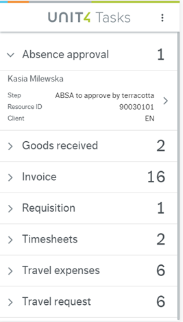
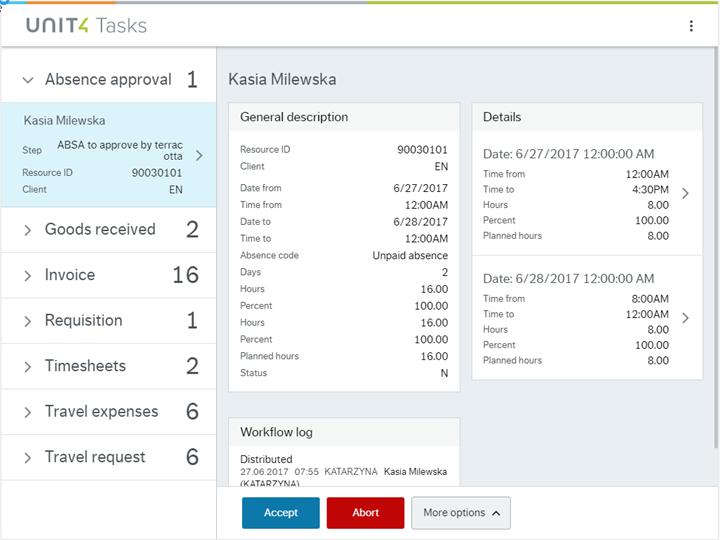

# Tasks Assistant

Wanda's Tasks Assistant provides the possibility for managers to approve tasks It can also flag important tasks and proactively push against deadlines and due dates. 
Moreover, it helps employees to keep up to date on status of submitted travel requests, expenses, purchase requests and timesheets.

### System requirements

- Task service V201209 configured
- Task Management Experience Pack 2.3 or later installed (latest version recommended)

### System setup

- Assign access rights to the Task service V201209
- Assign access to the following Public APIs:

    - Task management
    - Users
    - Companies
    - Query
    - Objects  
  
- Set access to the following objects in the **(XAG002) Object access** window on the web client:

    - Countries
    - Periods
    
- Specify the Process definition for each element type with distribution rules for the users. For further details on process definition, see [Reference Manual Spring 2017 - Workflow](http://abwdocs.agresso.no/Restricted/Docs/CustDocSpring2017/Spring2017/RefMan_Workflow_Spring2017.pdf) 
- Set the relevant Window options for the Tasks web service. A minimum number of fields must be visible in order to guarantee the information shown by Wanda about the tasks:

| Element type    | Minimum requirements                                                                               |
| -------------   |----------------------------------------------------------------------------------------------------|
| Absences        | Resource, date from, date to, total absence hours, time from, time to, total absence hours per day |
| Goods Received  | Order number, supplier, line number, product description, delivered quantity                       |
| Invoices        | Supplier, invoice number, amount to approve, currency                                              |
| Purchase Orders | Requisitioner, supplier, product description, quantity, unit code, price, currency                 |
| Requisitions    | Requisitioner, product description, quantity, unit, price                                          |
| Timesheets      | Resource, hours to approve, project, time, time unit                                               |
| Travel Expenses | Resource, purpose, expense description, amount                                                     |
| Travel Requests | Resource, country                                                                                  |

### Tasks notifications setup

See [Wanda notifications guide](notifications-setup.md).

### Element types

The following element types are available with the Tasks Assistant and the new Tasks Web app: 
- Absences 
- Timesheet
- Requisitions
- Good receipts
- Purchase orders, 
- Invoices
- Travel expenses
- Travel requests

Several tasks can be approved at the same time, except for invoices and travel expenses. When approval tasks are shown (either because the user has required it or it is a notification), actions can be performed on the tasks, such as approving or rejecting them, as well as navigating to the new **Tasks** web application to view more details or different actions.  **Tasks** deals with pending approval tasks. It organizes the tasks according to their element types, and it is responsive.

*Tasks mobile view* | *Tasks tablet view*
- | - 
 | 

