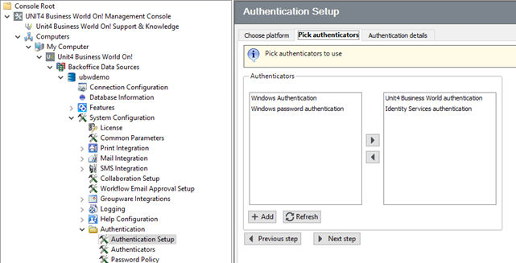

# Unit4 Identity Services setup on Business World to use Wanda 

## Introduction

### This guide
This guide provides a summary of the required setup of U4IDS on Business World using Business World management Console and is aimed at:

* Consultants and customer system admin level staff tasked with configuring Business World to work with U4IDS where Business World is being run on-premise
* Unit4 cloud ops staff tasked with configuring Business World to work with U4IDS where Business World is being run in the Unit4 cloud environment

 > This guide does not describe U4IDS or Business World authentication. For more details on these, see the [U4IDS general documentation](https://docs-external.u4pp.com/identity-services/) and the  [Authenticator setup reference manual](http://abwdocs.agresso.no/Restricted/Docs/CustDocSpring2017/Spring2017/RefMan_Authentication_Spring2017.pdf) (access to Unit4 Business World Product Documentation required).

### Registration with Unit4 Identity Services and Discovery Service
The Unit4 Identity Services (U4IDS) is an external cloud service used to provide authentication for the Wanda ecosystem. Configuring Business World to use U4IDS authentication involves registration of the Business World application with U4IDS and configuration of Business World authentication.

To use Wanda the customer Business World installation must be assigned an IDS authority an IDS tenant ID and an IDS Scope, and registered with the Unit4 Identity Services and Unit4 Discovery Service. This is done by Unit cloud ops.

### Configuration parts
Once the Business World installation is registered to use U4IDS, the following IDS configuration is required for Wanda to use the required Business World functionality:

* Setting IDS authentication as the accepted authenticator in the **Authentication setup** node (or the **TAG106 Authenticator setup** window on the Business World Desktop client), and mapping users to Unit4 IDs in the **User Master File** node (or the **TAG064 User master file** window on the Business World web client) &mdash; this is configured by the customer 
* Configuring Business World web services (SOAP services) and Business World web API to use IDS &mdash; this is configured by Cloud ops in a Business World cloud installation, or the customer in a Business World on-premise installation

## Setting IDS authentication as the accepted authenticator

IDS authentication must be set up as the accepted authenticator for each platform used by Wanda (in this case **Web services**) in the **Authentication Setup** node as shown below.  

If required, this can also be configured in the **(TAG106) Authenticator setup** window on the Business World Desktop client.

## Mapping Business World users to Unit4 IDs 

Each user who will use Wanda must have his or her Business World user mapped to a Unit4 ID, as the Unit4 ID is used by U4IDS to provide authentication for Wanda. This is done in the **User Master File** node on the _**Security**_ tab, by defining the _Unit4 ID_ and the _Logon company_. 

 

This then allows the user's organization account to communicate via Wanda with the defined default sign on company as the selected Business World user.

## Configuring IDS for web applications

IDS must be configured for each web application (in this case Business World web services (SOAP services) and Business World web API). This is done in the **Authentication** node for each web application.

In each case the _Base URL_ is the IDS authority and the _Tenant Id_ is the IDS tenant ID. These, along with the _Scope Name_ (normally u4bw) and the _Scope Secret_ are provided when the Business World application is registered with U4IDS.

### Business World web services (SOAP services)

 >Due to a bug in Business World, currently the scope secret and the set of IDS configuration for the SOAP Web Services needs to be exchanged between the Unit4 Cloud organization and the administrator of Business World. This bug will be addressed in a future Business World release and this step will not be required in future.
 

Note that _Scope secret_ is only required in the SOAP authentication setup. This is due to an error in the IDS authentication middleware in U4BW.

### Business World web API

In the example below, the authentication type is set to **Identity Services Authentication**. However, this can be set to **All Authentications** if basic authentication is also needed.  
 
 

Note that this is a setting stored in the global web.config so it will apply to all web apps/tenants running on the server and will force a restart of any running web API apps. Therefore, this can be disabled in the global web.config if U4IDS isn't required globally.

   

