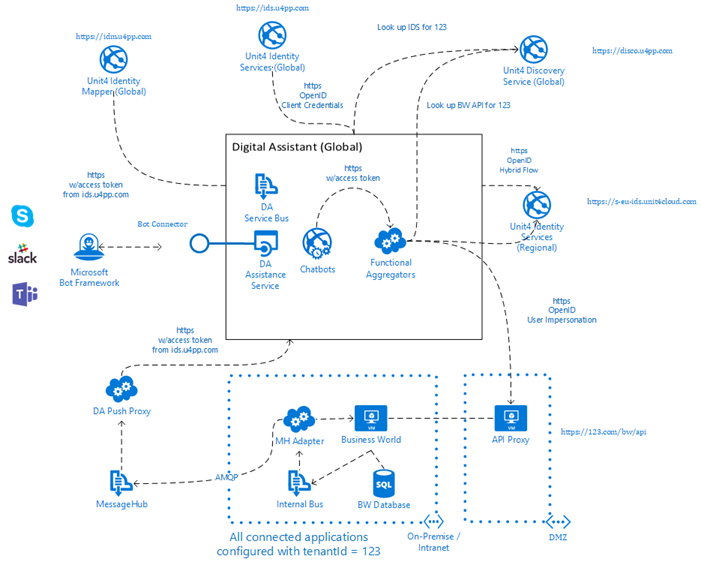

# Wanda deployment scenarios

### Supported scenarios
The Unit4 Wanda service can be deployed in the following scenarios. 

1. Public cloud
2. Managed cloud, where the Unit4 application and services are hosted and managed in the cloud
3. Hybrid cloud, where the Unit4 application is hosted on-premise, or where the Unit4 Platform services are hosted in the cloud  

### Required Unit4 Platform services
The following Unit4 Platform services are required:

- Unit4 Identity Services (U4IDS) to provide external authentication and identity mapping. U4IDS is a multi-tenant Federation Gateway using the OpenID protocol
- Unit4 Message Hub to provide message handling / management

## Public cloud
The Unit4 Wanda service will be available on Unit4's public Azure offering and details will be provided when this is made available.

## Managed cloud and Hybrid cloud 

These two scenarios have the same implementation as described in this section, with the only difference being that the Business World installation is located in different places. In the Managed cloud scenario the Business World application is installed and running in Unit4's data center and is managed by Unit4 cloud ops, and in the Hybrid cloud scenario the Business World application is installed and running on-premise at the customer’s location and is managed by the customer.

